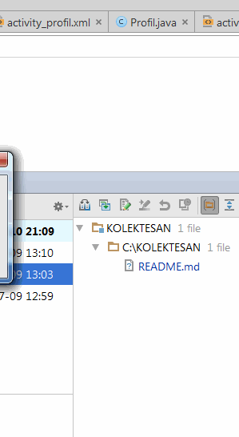

## KOLEKTE SAN
  Application don de sang
  
## Principales Fonctionnalités 
 
L'application Don de Sang permet de :
 * [X] géolocaliser et calculer l'itinéraire vers les lieux de collecte de sang les plus proches,
 * [X] inviter ses amis à participer à la collecte par mail, sms ou Facebook,
 * [X] appeler directement un site fixe de collecte pour prendre rendez-vous,
 * [X] évaluer son aptitude au don de sang grâce à un questionnaire en ligne (qui ne remplace cependant pas l’entretien médical conduit par le médecin de collecte),
 * [X] ajouter les dates de collectes et de fin de contre-indication dans l’agenda,
 * [X] planifier son prochain don (sang total, plasma, plaquettes),
 * [X] s'informer sur le don de sang (les besoins en sang, les chiffres clés, etc.),
 * [X] partager des informations pour sensibiliser son entourage au don de sang,
 * [X] consulter des vidéos et les actualités sur le don et la transfusion sanguine.

 
## Video Walkthrough 

Here's a walkthrough of implemented user stories:

GIF created with [LiceCap](http://www.cockos.com/licecap/).

## Licence
   Touts droits réservés © Etzer Emile 
